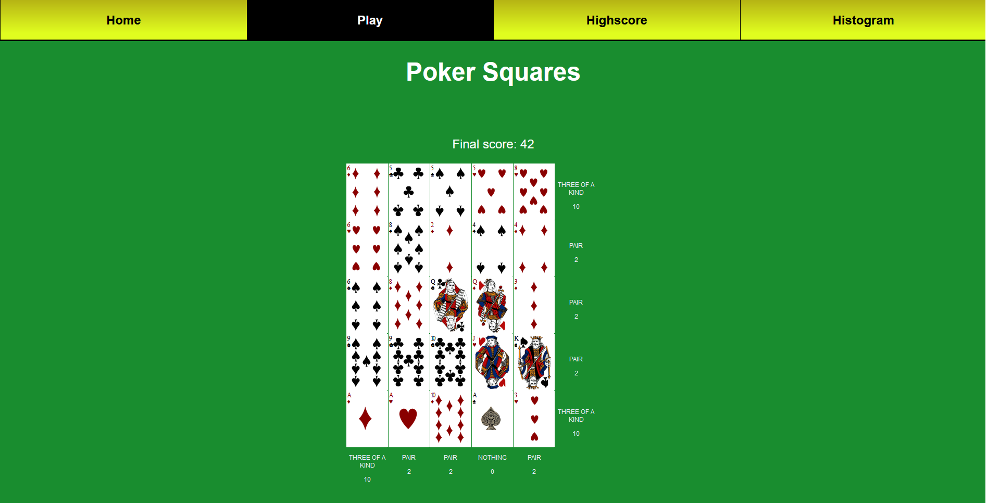

# Poker Squares

## Introduction

In this project for the course MVC in web programming spring -21 I've made a game called Poker Squares. The aim of the game is to gather as many points as possible by playing out cards and create valuable poker hands. Score high and you might place yourself on top of the highscore list!

You can try the game here:

http://www.student.bth.se/~joki20/dbwebb-kurser/mvc/me/proj/public/

## Rules

You have a grid consisting of 5x5 empty cells. Each turn a new card in the deck shows up and you have to click on one of the empty cells to place the card there. As soon as a row or column contains five cards, points for that poker hand is valued accordingly:

<table>
<thead>
<th>HAND</th>
<th>POINTS</th>
<th>EXPLAINATION</th>
</thead>
<tbody>

<tr>
<td>Royal Straight Flush</td>
<td>100</td>
<td>10 J Q K A in same suit</td>
</tr>

<tr>
<td>Straight Flush</td>
<td>75</td>
<td>Straight in same suit</td>
</tr>

<tr>
<td>Four of a kind</td>
<td>50</td>
<td>Four of same value</td>
</tr>

<tr>
<td>Full house</td>
<td>25</td>
<td>Three of the same value + Two pairs</td>
</tr>

<tr>
<td>Flush</td>
<td>20</td>
<td>All cards in the same suit</td>
</tr>

<tr>
<td>Straight</td>
<td>15</td>
<td>Cards with consecutive values</td>
</tr>

<tr>
<td>Three of a kind</td>
<td>10</td>
<td>Three of the same value</td>
</tr>

<tr>
<td>Two pairs</td>
<td>5</td>
<td>Two different pairs, each with same value</td>
</tr>

<tr>
<td>Two pairs</td>
<td>5</td>
<td>Two cards with same value</td>
</tr>

</tbody>
</table>

For a hand you can only score one of above. For example, If you have four of a kind, you will not also score for three of a kind.

## Highscore

After you finished a game, you can go watch the highscore list and see where you placed. The list contains the name you chose at the start of the game and your total sum of all ten hands.

## Histogram

In the histogram you can see the distribution of all previous hands played, in every game played (10 hands for each game). In this way you can analyze how common it is to score different kind of hands. For example, in time you can expect a Straight Flush to score less often compared to three of a kind since it is much harder to get.

## Download the game

To run this repository you need:
* Cygwin
* Git
* PHP in your path
* Composer (package manager for PHP)
* XAMPP
* MySQL WorkBench

#### Setup environment

1. Install Cygwin [here](https://cygwin.com/install.html)

2. Install Git [here](http://git-scm.com/download). Select option "Use Git from the Windows Command Prompt", and then option "Checkout as-is, commit as-is" in order to not affect your files automatically. Check that git is installed in Cygwin by typing **git --version**

3. Make sure PHP is in your PATH: https://dbwebb.se/kunskap/lagg-php-i-pathen

4. Download Composer [here](https://dbwebb.se/kunskap/installera-composer)

5. Download XAMPP [here](https://www.apachefriends.org/download.html) and follow [this guide](https://dbwebb.se/kunskap/installera-en-egen-webbserver-for-utveckling#install)

Check that it works by typing **make --version**

6. Download MySQL Workbench [here](https://dev.mysql.com/downloads/workbench/)

#### Download and run repository

1. Make sure XAMPP is running on port 8080 with MySQL.

2. Click menu option 'Code' and copy the HTTPS or SSH link to this git and then type either of the following inside folder C:/xampp/htdocs in your terminal:
* **git clone https://github.com/joki20/dbwebb-mvc-proj.git**
* **git clone git@github.com:libgit2/libgit2.git**

This creates a directory dbwebb-mvc-proj in that folder, containing all the files for this repository.

3. Go to this folder and type **composer install** to download all php packages specified inside composer.json

4. Rename file env.example to .env

5. Run file database/pokerhighscores.sql in MySQL Workbench as 'root' user (no password) in order to setup the database and its table. It will create a database called 'joki20'. These details can be found in the .env file

6. You might have to run the command **php artisan key:generate**

7. Start playing the game by going to http://localhost:8080/dbwebb-mvc-proj/ and click 'public' folder
